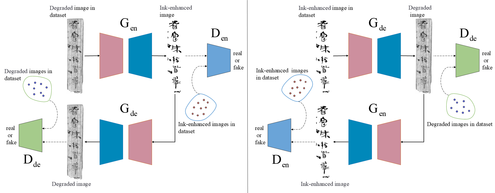
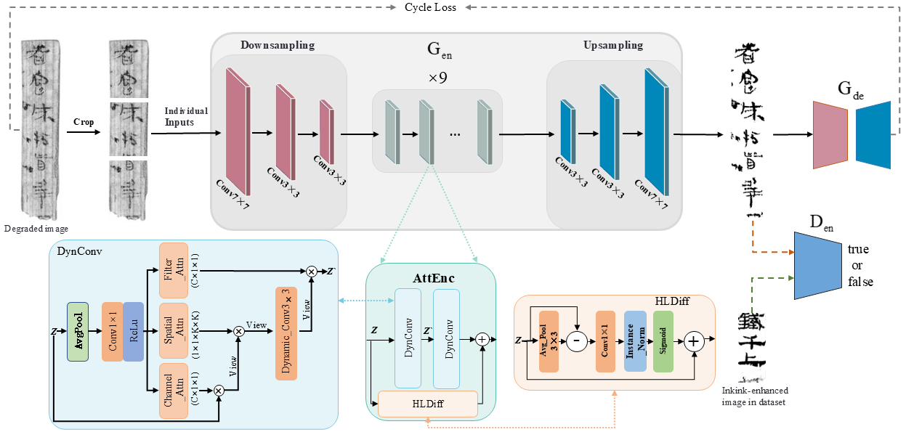
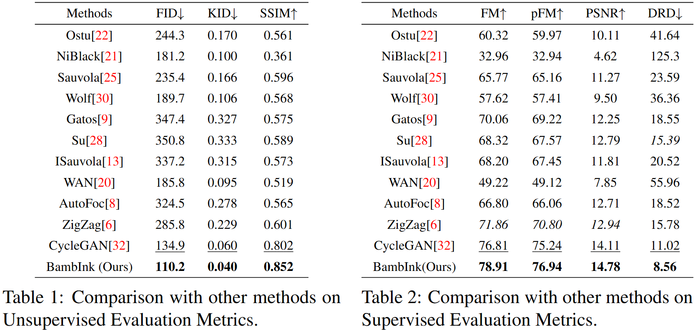

# BambInk

## Overall
<p align="center">
  
</p>

## Architecture
<p align="center">
  
</p>

## Using the code:
The code is stable while using Python 3.8.3, PyTorch 1.13.0, CUDA =11.4.

## Data Presentation and Model Parameters
- We provide a selection of results, including the original inputs and the enhanced model outputs, at the [link](https://drive.google.com/drive/folders/1-8aSNbFd5BKs0ZmNHY0dBxWj2PXGB9ea?usp=drive_link).
- Furthermore, we have provided the optimal model [parameters](https://drive.google.com/drive/folders/1GvsHvcw-RwCF_Pi9iiPidcIzCva0frw7?usp=drive_link).

## DataFormat
Make sure to put the files as the following structure:
```
dataset
├── train
|   ├── A
|   │   ├── ...
|   │
|   └── B
|       ├── ...
|
└── test
    ├── A
    |   ├── ...
    |
    └── B
        ├── ...
```

## Training and Validation
### 1) Train the model.
```
python train.py --dataroot path_dataset --lr 0.0002 --n_epochs 100 --size 256 --batchSize 4
```

### 2) Test.
```
python test.py --dataroot path_dataset --size 256 --batchSize 4
```

## Comparison with other methods
<p align="center">
  
</p>

## Visual comparison
<p align="center">
  
</p>
